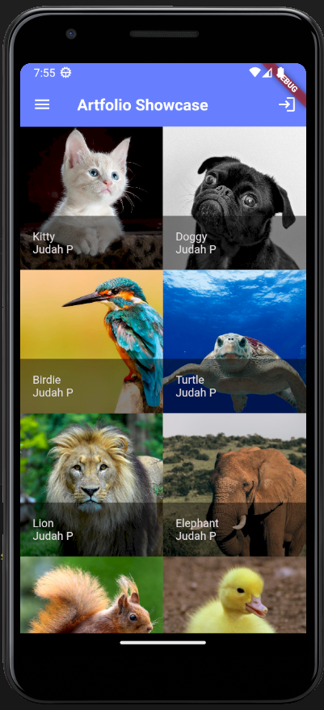
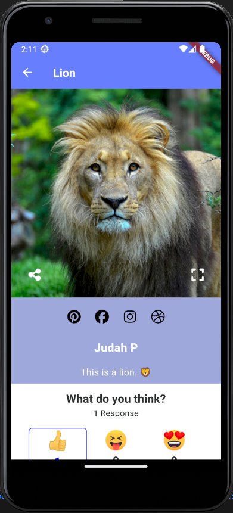

# Artfolio 📱🎨
 Artfolio is a mobile app designed to empower artists by providing a platform to showcase their creative work, connect with potential clients, and receive valuable feedback. Designed to be forked and customized, Artfolio is built with Flutter and SQL, making it easy to deploy and manage your own version of the app. Whether you're a painter, photographer, graphic designer, or any other type of artist, Artfolio is the perfect tool to help you grow your brand and reach a wider audience.

## Features 🚀
- **Portfolio**: Showcase your creative work with a beautiful and customizable portfolio.
- **Contact**: Connect with potential clients by providing your contact information.
- **Feedback**: Receive valuable feedback from users to help improve your work.
- **Customizable**: Easily customize the app to match your personal brand and style.

## Getting Started 🛠
To get started with Artfolio, follow these steps:

1. **Fork the Repository**: Click the "Fork" button on the upper-right corner of the repository to create your own copy.

2. **Clone the Repository**: Clone the repository to your local machine using the following command:
   ```sh
   git clone https://github.com/judahpaul16/artfolio
    ```

3. **Install Dependencies**: Navigate to the project directory and install the required dependencies using the following command:
    ```sh
    flutter pub get
    ```

4. **Run the App**: Run the app on an emulator or physical device using the following command:
    ```sh
    flutter run
    ```

The default username and password for the app are `admin` and `admin123` respectively. You can change these values in the `assets/settings.json` file.

## Customization 🎨
Artfolio is designed to be easily customizable to match your personal brand and style. Here are a few ways you can customize the app:

- **Colors**: Change the primary and accent colors in the `theme.dart` file.
- **Fonts**: Update the font styles and sizes in the `theme.dart` file.
- **Images**: Replace the branding images in the `assets` directory with your own images.
- **Text**: Update the text content in the `assets/settings.json` file to reflect your personal information.

## Contributing 🤝
Artfolio is an open-source project and contributions are always welcome! To contribute to the project, follow these steps:

1. **Fork the Repository**: Click the "Fork" button on the upper-right corner of the repository to create your own copy.

2. **Clone the Repository**: Clone the repository to your local machine using the following command:
   ```sh
   git clone https://github.com/judahpaul16/artfolio
    ```

3. **Create a Branch**: Create a new branch for your contribution using the following command:
    ```sh
    git checkout -b new-branch-name
    ```

4. **Make Changes**: Make any necessary changes to the project.

5. **Commit Changes**: Commit your changes to the branch using the following command:
    ```sh
    git commit -m "Your commit message"
    ```

6. **Push Changes**: Push your changes to the branch using the following command:
    ```sh
    git push origin new-branch-name
    ```

7. **Create a Pull Request**: Create a new pull request from your branch to the main repository.


## License 📝

Distributed under the MIT License. See `LICENSE` for more information.

## Screenshots 📸

